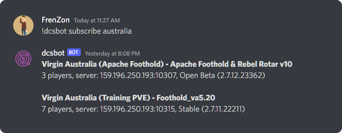

## dcsmon

Command-line server browser for [Digital Combat Simulator](https://digitalcombatsimulator.com/)

## Usage

Download the latest dcsmon.exe executable from the [releases](https://github.com/glenmurphy/dcsmon/releases) page

Use your DCS username and password

    dcsmon -u username -p password

Filter on server names using the -f option

    dcsmon -u username -p password -f australia

Other options may be added later, see them with

    dcsmon --help

## Develop

Requires [Rust](https://www.rust-lang.org/tools/install)

    git clone https://github.com/glenmurphy/dcsmon.git
    cd dcsmon
    cargo run -- -u username -p password
    cargo build --release

The last command will create dcsmon.exe in your dcsmon/target/release directory - move it to whereever you wish